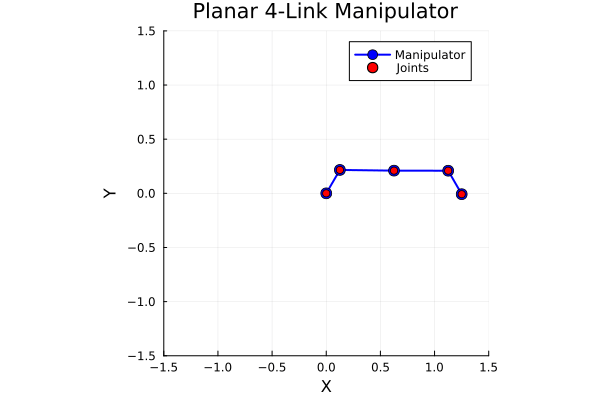
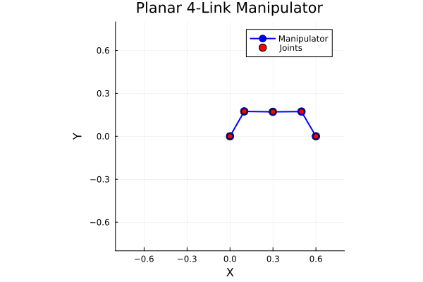

# 5barLinkage

- This repository contains a Julia script that derives and simulates the nonlinear state-space equations of motion of a 5 bar linkage mechanism, actuated at its base. Aim is to output data to be used by SINDy-PI

The derivation of the dynamic model is detailed in [the jpg.](./hand_derivation.jpg)
Take a look at src/main.jl for the step by step implementation.

## Preliminaries
- Install VSCode

- [Install Julia](https://docs.julialang.org/en/v1/manual/installation/)

- Install the Julia extension in VSCode

- From cmd prompt, clone this repository and navigate into to this folder:
 ```bash
git clone https://github.com/sherschm/5barLinkage.git
cd 5barLinkage
code .
```

- run src/main.jl from VSCode. The first time may take a while due to importing / precompiling several required Julia packages.
This is a commented script that runs through the model derivation, making use of the Julia Symbolics.jl toolbox.

Then, it simulates the unconstrained system's free response (no motor torque). This is just a swinging 4-link pendulum:

 
 
Then, it simulates the constrained linkage system in response to chosen motor torque profile.



## Next steps...
- put in correct linkage parameters.
- Generate $[\dot{X}]$  data array. I think a good option is to use an acausal filtering technique such as Savitzky Golay algorithm.
